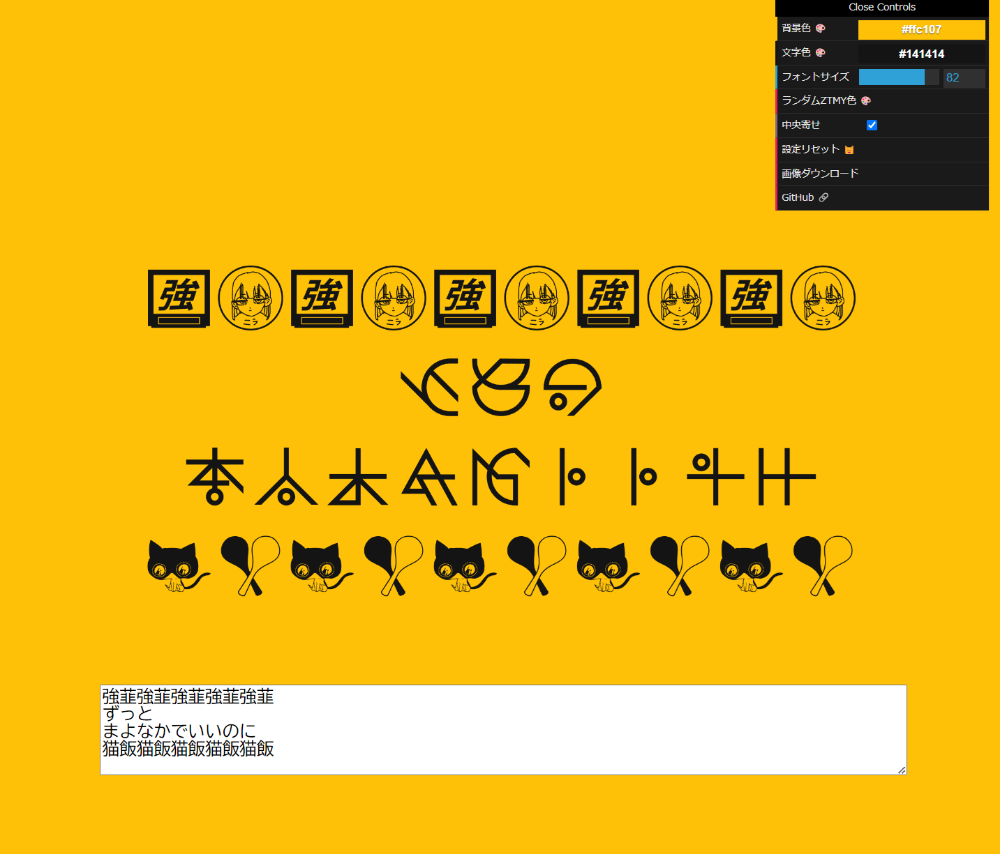

# ZTMY Font Tester🦔
Version 0.8.0  

# Description🖊️
ZTMYフォントで試し書きするためのツールです。  
※ 後日公開予定の[ztmy-font-decoder](https://github.com/tetunori/ztmy-font-decoder)の検証用途で作成。

# Usage🪄
1. [ztmy-font-tester](https://tetunori.github.io/ztmy-font-tester/)にアクセスする。
2. 画面の上半分をタップするか、[ここ](https://zutomayo.net/font/)からZTMYフォントをダウンロードする。
3. 画面の下半分をタップして、ダウンロードしたZTMYフォントを選択する
4. 自由に試し書きをどうぞ～  

右上のコントローラーから以下もできます。
- 背景色の変更
- 文字色の変更
- フォントサイズの変更
- ZTMYカラーからランダムに背景色・文字色を選択
- 左揃え⇔中央寄せ の変更
- (上記の)設定の(猫)リセット
- 画像としてダウンロード
- GitHub(このページ)への移動

# License⚖️
Copyright (c) 2024 [Tetsunori Nakayama](https://github.com/tetunori). MIT License.

# Author🧙‍♂️
Tetsunori Nakayama

# References📚
## p5.js
[p5.js](https://github.com/processing/p5.js) by [Processing Foundation](https://github.com/processing). GNU Lesser General Public License v2.1.

## dat.gui
[dat.gui](https://github.com/dataarts/dat.gui) by [Google Data Arts Team](https://github.com/dataarts). Apache License 2.0.

## Hedgehog png
A hedgehog picture is from [fluentui-emoji](https://github.com/microsoft/fluentui-emoji) by [microsoft](https://github.com/microsoft). MIT License.
